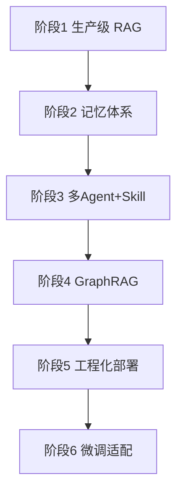

# 详细学习路线手册 —— 对标企业 AI 应用开发 JD

> 本手册把「AI 应用开发工程师」招聘要求拆成 6 个可执行阶段。每阶段 = 知识点 + 可跑产出 + 可观察验证。
> 学习节奏（继承前三个项目）：讲解 → 写代码实跑（零成本冒烟优先）→ 三问法精读 → 落盘 `lessons\` → 一次一问。
> **一次只推进一个阶段**，每阶段可停靠、可验收，不追求一口气学完。

## 一、总览：为什么是这六个阶段

现有能力是「理解层」（会搭 Agent、会写 RAG、懂 MCP）；JD 要的是「生产层」（可部署、可观测、可扩展、可并发）。六个阶段从「检索质量」→「记忆」→「协作」→「知识结构」→「工程」→「模型」，层层递进，最后收敛成一个**企业 AI 助手平台**。

## 二、阶段 1 · 生产级 RAG 服务

**目标**：把「能检索」升级为「检索得准 + 可当服务调用」。
**对标 JD**：③（RAG 全链路）、⑥（向量库调优）、②（API 服务封装）。
**模块**：`src\rag\`、`src\api\`（起步）

| 知识点 | 做什么 / 为什么 | 产出 |
|--------|----------------|------|
| 文档切分策略 | 固定窗口 / 递归字符 / 语义分块——切分粒度直接决定召回质量，是 RAG 第一道杠杆 | 三种切分对比脚本 |
| Embedding 工程 | 模型选型（沿用 BGE 中文）、批量编码、向量归一化——影响召回准确率与吞吐 | 编码工具模块 |
| 向量库选型 | chromadb（已有）对比 Qdrant/Milvus 的生产特性（持久化、元数据过滤、水平扩展） | 选型对比笔记 |
| **混合检索** | BM25 关键词 + 向量语义 → 融合（RRF / 加权）——纯向量在专有名词/编号上易漏 | 混合检索模块 |
| **Rerank 精排** | 召回粗排（Top-K）→ bge-reranker 精排（Top-N）——召回率高但排序差时救命 | rerank 模块 |
| **检索评估** | 建评测集（问题→应命中文档）+ 指标（hit rate / recall@k / MRR）——把「感觉准」变成「测出来准」 | 评估脚本 + 报告 |
| FastAPI 服务化 | `POST /qa` + Pydantic 请求/响应模型 + 异步 + 错误处理——从脚本到服务 | 可跑的 API |

**可跑产出**：① 一个 `uvicorn` 起得来、`curl` 得通的 `POST /qa` 检索问答服务；② 一份检索策略 A/B 报告（无 rerank vs 有 rerank 的命中率对比）。
**验证**：服务启动 + 冒烟请求 exit 0；评估报告分数来自真实实跑（非编造）。
**依赖（探针）**：FastAPI/uvicorn/chromadb ✅ 已就绪；rerank 模型按需下载。

## 三、阶段 2 · 记忆体系

**目标**：从「thread 级对话记忆」升级为「长期记忆 + 召回 + 遗忘」。
**对标 JD**：③（长短记忆、召回遗忘、语义压缩、意图识别）、④（记忆沉淀）。
**模块**：`src\memory\`

| 知识点 | 做什么 / 为什么 |
|--------|----------------|
| 短期记忆 | 对话窗口管理、token 预算、滚动摘要、语义裁剪——控制上下文成本 |
| **长期记忆** | 从对话中抽取事实 → 向量化存储 → 跨会话语义召回——让 agent「记得你是老客户」 |
| 记忆召回 | 相关性 + 时效 + 重要性加权排序 |
| **遗忘机制** | TTL 过期 / 重要性评分衰减 / 容量驱逐——记忆不是越多越好，冗余会污染召回 |
| 语义压缩 | 长对话 → 结构化摘要——长文本落库前压缩 |
| 意图识别 | 分类路由（查知识 / 查订单 / 投诉…）——多轮对话的入口分流 |

**可跑产出**：给客服 agent 加长期记忆，演示「会话 A 说偏好 → 会话 B 记得」+「过期记忆不再召回」。
**验证**：跨会话召回实验（可观察）+ 遗忘实验（可观察）。
**依赖**：向量存储复用阶段 1；无需新服务。

## 四、阶段 3 · 多 Agent 协同 + Skill 编排

**目标**：从「单 Agent 工具循环」升级为「多 Agent 分工协作」。
**对标 JD**：①（多智能体协同、自动化业务编排）、④（MCP、Skill 插件编排）。
**模块**：`src\agents\`

| 知识点 | 做什么 / 为什么 |
|--------|----------------|
| supervisor/worker 模式 | 一个调度 agent + 若干专家 agent——任务分解与路由的标准范式 |
| Agent 间通信与状态共享 | 共享状态 / 消息传递——协作的基础设施 |
| 任务分解与分配 | 复杂请求拆成子任务并派给合适 agent |
| **MCP 工具集成** | 复用 `..\mcp-hello1`（server/client/tool-loop）——把外部能力接进来 |
| **Skill 插件编排** | 技能的注册 / 发现 / 调用机制——可扩展的能力目录 |
| 协作失败处理 | 某 agent 失败时的重试/降级/转发 |

**可跑产出**：多 Agent 客服系统（分诊 agent → 检索 agent / 订单 agent / 审批 agent），用 MCP 挂外部工具。
**验证**：一个请求经多 agent 协作端到端完成，exit 0 + 完整轨迹日志。
**依赖**：LangGraph（已熟）+ MCP（已学）。

## 五、阶段 4 · GraphRAG / 知识图谱融合

**目标**：补上「关系型知识」的检索盲区。
**对标 JD**：④（知识图谱融合 RAG、GraphRAG）。
**模块**：`src\graphrag\`

| 知识点 | 做什么 / 为什么 |
|--------|----------------|
| 知识图谱基础 | 实体 / 关系 / 三元组——把文本变成结构化知识 |
| 实体关系抽取 | LLM 抽取 + 校验（防幻觉）——建图的原料 |
| 图存储 | networkx（轻量）或 Neo4j（生产）——按探针选型 |
| **GraphRAG** | 社区检测 + 图检索——回答「跨文档、需多跳」的关系型问题 |
| 图 + 向量融合 | 何时走向量、何时走图、如何合并结果 |

**可跑产出**：对一份文档建图 + GraphRAG 问答；「纯向量 RAG vs GraphRAG」在关系型问题上的对比。
**验证**：建图脚本 exit 0；对比实验有量化结果。
**依赖**：networkx（pip 可装，纯 Python）。

## 六、阶段 5 · 工程化与生产部署

**目标**：从「单机脚本」升级为「可部署、可观测、可并发」的服务。
**对标 JD**：②（高可用高并发）、⑤（自动化部署）、⑥（缓存/限流/监控/成本）。
**模块**：`src\api\`

| 知识点 | 做什么 / 为什么 | 探针结论 |
|--------|----------------|---------|
| **PostgreSQL 持久化** | 会话/记忆/checkpointer 生产化——多实例共享状态 | ✅ 5432 在跑 |
| **缓存** | 语义缓存（相似问题直接命中）——省 token、降延迟 | ✗ Redis 缺 → 降级内存/文件，可选安装 |
| **限流** | 令牌桶 / 滑动窗口——保护后端与成本 | 纯代码实现 |
| **负载均衡** | 多实例 + 无状态化 + 前置分发 | 本地多进程模拟 |
| **Token 成本控制** | 用量统计 / 预算 / 超限降级——直接对应企业关心的钱 | 纯代码实现 |
| **全链路监控** | LangSmith / OpenTelemetry + 结构化日志——出问题能查 | LangSmith 已有基础 |
| **部署** | Docker + docker-compose（或降级本地多进程编排）| ✗ Docker 缺 → 降级脚本 |
| CI | 测试门禁（push 即跑冒烟）| 复用 AppTest 习惯 |

**可跑产出**：一键起服务（API + 缓存 + Postgres）；并发压测（N 并发请求）与限流触发实测；Token 成本统计。
**验证**：服务端到端跑通；限流触发有日志；成本统计有真实数字。
**依赖**：PostgreSQL ✅；Redis/Docker 缺 → 计划内降级，需时装。

## 七、阶段 6 · 模型微调适配

**目标**：理解并跑通「让模型适配你的领域」的流程。
**对标 JD**：⑤（模型微调适配）。
**模块**：`src\finetune\`

| 知识点 | 做什么 / 为什么 |
|--------|----------------|
| 微调概念 | 全量微调 vs LoRA / QLoRA——为什么小样本用 LoRA |
| 数据准备 | 指令数据构造 / 清洗 / 格式（训练集/验证集切分） |
| **微调流程** | 本机 RTX 4060 8GB → 选小模型（如 Qwen 0.5B~1.5B）做 QLoRA |
| 评估 | 微调前后在同一评测集上的指标对比 |
| 部署 | 微调产物的本地推理服务（可接回阶段 5 的 API） |

**可跑产出**：一个小模型 LoRA/QLoRA 微调实验（若显存/依赖不足，退化为「云 / 纯演示 + 讲清原理」）。
**验证**：微调前后指标对比（有 GPU 则真实跑；不可行时**如实标注**，不假装跑通）。
**依赖**：RTX 4060 8GB ✅；需装 peft/transformers/datasets（按需）。

## 八、学习节奏建议

- **一阶段一闭环**：每个阶段独立产出、独立验证，学完即有一段可展示的成果。
- **零成本优先**：能用假模型/假 agent 冒烟的环节不发真实 API 请求；真实 API 只用于关键验证。
- **复用以省力**：LLM 封装、工具、eval 判据、MCP 代码都能从现有三项目复用，不重写。
- **每阶段结束可停靠**：用户是节奏拍板人，可跳可停可回看。
- **难度递增**：阶段 1-2 承接已有基础，阶段 3-4 引入新范式，阶段 5-6 补工程与模型层。
