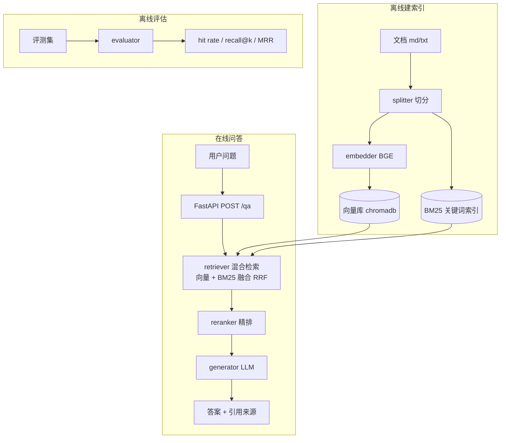

# 设计：DocQA — 技术文档问答服务（阶段 1）

> 所属：AI-Application-Engineering / 阶段 1（生产级 RAG 服务）
> 日期：2026-09-12 ｜ 状态：待评审

## 一、背景与目标

用户已完成 LangChain / LangGraph / MCP 三线学习（**理解层**：会搭 Agent、会写 RAG、懂 MCP）。本设计是「生产层」的起点：把 RAG 从**脚本**做成**可被调用的服务**。

- **复用**：旧项目 `LangChain-RAG-Agent\scripts\phase4_1_rag.py` 的 ONNX BGE embedding（WordPiece 分词 + CLS 池化 + 归一化）与 chromadb 余弦空间经验。
- **要补的缺口**（旧实现 → 生产级）：整份文档入库无切分 → 要切分；纯向量检索 → 要混合检索；无精排 → 要 rerank；无评估 → 要评测集；无 API → 要 FastAPI。

**目标产出**：① 一个可 `curl` 的技术文档问答 API；② 一份检索策略 A/B 评估报告（有真实分数）。

## 二、范围（四步递进）

| 步 | 主题 | 可验证小成果 |
|----|------|-------------|
| 1 | 切分 | 三种切分策略对比脚本（块数/重叠/边界质量） |
| 2 | 检索 | 向量检索可用（问题→命中相关块） |
| 3 | 混合 + rerank | 混合检索（向量+BM25 融合）+ 精排，检索质量提升可测 |
| 4 | 评估 + API | 评测集打分 + FastAPI 服务（`POST /qa` 可 curl） |

## 三、非目标（YAGNI）

- 不做前端 UI（本阶段以 API 为交付界面）
- 不做多租户 / 鉴权 / 权限
- 不做 OCR / PDF / 多格式解析（只处理 `.md` / `.txt`）
- 不做容器化 / 分布式（留阶段 5）
- 不追求 SOTA 检索效果，追求**链路完整 + 每步可测**

## 四、架构



## 五、模块设计（单一职责、可独立测试）

| 模块 | 职责 | 关键接口 | 依赖 |
|------|------|---------|------|
| `src/rag/splitter.py` | 文档切分（固定/递归/语义三种策略） | `split(text, strategy, size, overlap) -> list[Chunk]` | 无（纯函数，最易测） |
| `src/rag/embedder.py` | 文本→向量（复用 ONNX BGE） | `embed(texts) -> list[list[float]]` | onnxruntime |
| `src/rag/store.py` | 向量库封装（chromadb） | `add(chunks)` / `query(vector, k)` | chromadb |
| `src/rag/bm25.py` | 关键词索引（BM25） | `add(chunks)` / `query(text, k)` | rank_bm25 |
| `src/rag/retriever.py` | 混合检索（向量+BM25 → RRF 融合） | `retrieve(query, k) -> list[Chunk]` | embedder/store/bm25 |
| `src/rag/reranker.py` | 精排 | `rerank(query, chunks, top_n) -> list[Chunk]` | cross-encoder（见选型） |
| `src/rag/generator.py` | LLM 生成答案 + 引用 | `generate(query, chunks) -> Answer` | DeepSeek |
| `src/api/main.py` | FastAPI 路由 | `POST /qa`、`POST /ingest`、`GET /health` | 以上全部 |
| `src/evaluation/evaluate.py` | 评测集 + 指标 | `evaluate(strategy) -> Metrics` | retriever |
| `tests/` | 零成本冒烟（假 embedding/假 LLM） | pytest | — |

**边界原则**：每个模块都能用假件（fake）单独测；`api` 只做编排，不含检索逻辑；`splitter` 是纯函数无外部依赖。

## 六、数据流（一次问答）

```
用户问题 "混合检索怎么融合"
  → API 校验（Pydantic）
  → retriever: embed(问题) → 向量库 Top-K  +  BM25 Top-K  → RRF 融合 → Top-M
  → reranker: (问题, 每个候选块) 打分 → 取 Top-N
  → generator: 拼 prompt（问题 + Top-N 块）→ DeepSeek → 答案 + 引用块来源
  → API 返回 {answer, sources[], latency_ms}
```

## 七、技术选型

| 环节 | 选型 | 理由 / 降级 |
|------|------|-------------|
| Embedding | BGE-small-zh（ONNX，复用旧项目） | 已在本机跑通、离线；不够用再升级 bge-m3 |
| 向量库 | chromadb 1.5.9 | 已装、够用；生产对比 Qdrant 留笔记 |
| BM25 | `rank_bm25` | 轻量纯 Python；缺则自实现简易版 |
| Rerank | BGE-reranker-base（cross-encoder） | **需下载，国内可能受阻** → 降级：先用 RRF 融合分替代，rerank 作为可选增强 |
| LLM | DeepSeek（OpenAI 兼容） | 已有 key |
| API | FastAPI 0.133 + uvicorn | 已装（探针确认） |
| 测试 | pytest + TestClient | 零成本假件 |

## 八、错误处理

- **LLM 调用失败** → 返回检索结果 + 明确错误，不假装成功
- **embedding 模型缺失** → 启动时 fail-fast，提示下载路径
- **检索为空** → 如实返回"知识库未覆盖"，不编造（沿用防幻觉原则）
- **输入校验** → Pydantic 模型拒绝空问题/超长问题
- **API 层** → 统一异常处理，返回结构化错误

## 九、测试策略

- **单元**：`splitter`（纯函数）、`retriever`（假 store/bm25）、`evaluator`（固定输入→固定分数）
- **端到端**：FastAPI `TestClient` 冒烟（假 LLM/假 embedding，不调 API）
- **真实验证**：关键节点跑真实 DeepSeek + 真实 embedding，证据留 `outputs/`
- 纪律：声称跑通须 exit 0 + 日志

## 十、四步递进路线（后续实施计划按此分波）

1. **切分**：splitter + 测试 + 三策略对比证据
2. **检索**：embedder + store + 基础向量检索 + 测试
3. **混合 + rerank**：bm25 + retriever 融合 + reranker + 对比证据
4. **评估 + API**：评测集 + API 服务 + 端到端冒烟 + 真实问答证据

## 十一、待验证假设（实施前探针）

- `rank_bm25` 是否可装（pip 镜像）
- BGE-reranker 模型能否获取（否则走降级方案）
- 复用旧项目的 ONNX BGE 模型文件是否可用（`LangChain-RAG-Agent\models\bge-small-zh`）
- 本地 lessons 语料的实际规模（是否够体现切分/检索难点）
