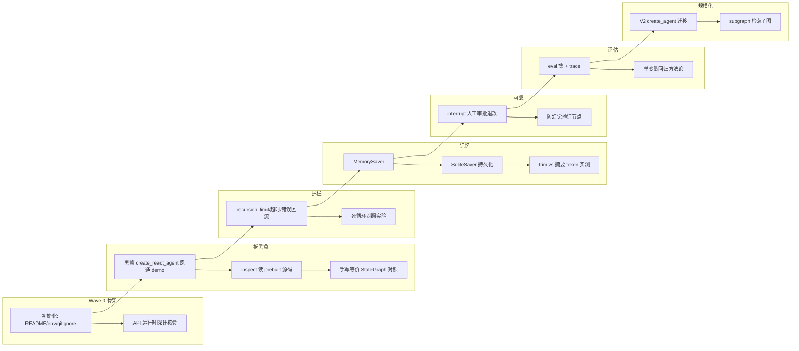
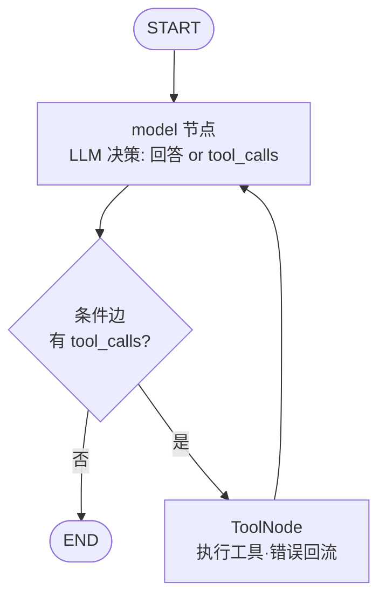

> **Model: deepseek-v4-flash (cheap)**

**执行状态：** 已闭环。Task 0-6 均已完成；验证通过；交付门检查：GREEN。

> **Status: APPROVED** — 2026-09-06T05:58:04.844Z

> **Status: EXECUTED** — 2026-09-07T14:50:18.422Z

# 全量 Agent 深度研学项目（LangGraph 技术支持助手）——从空目录到成品

## 需求提炼

**目标（用户原话提炼）**：用户想系统深度学习 Agent，要求"带我做一个全量的项目，包含 6 Phase 全部知识点，每个知识点详细讲解并给出代码说明"；已确认两条方向决策——① 新建独立项目，从空目录到成品完整走 6 Phase；② 业务场景用通用 Demo（"重点是学 Agent，不挑业务"）。

**非目标**：
- 不重教 LangChain 基础 / RAG / Tool Calling（用户在 LangChain-RAG-Agent 项目已完成 5 Phase + 3 专题，这些是前置知识而非本课内容）
- 不改动 / 不污染现有 LangChain-RAG-Agent 的 23 份脚本与 24 份文档（教学体系已封版）
- 不引入 embedding 模型文件与 chromadb（新 demo 用轻量本地检索，聚焦 Agent 本身，避免复制模型/重建向量库）
- 不做生产级部署（LangServe 等仅在 P6 作为可选项提一句，默认不做）

**教学契约（继承 LangChain-RAG-Agent 项目已立规矩，一条不破）**：每次讲解必须带实际运行的执行示例（实跑输出为证据）；一次只问一个问题；知识点必须落盘 lessons/ 文档（零基础可读：做什么/为什么/不做会怎样）；代码讲解用"三问法"（干什么/吃什么吐什么/为什么这么写）；证据来自实跑且可复现。

## 背景与起点（用户当前坐标）

用户已有基础（均有 file:line 实证）：
- LangChain 5 Phase 全完成：手写工具循环（`LangChain-RAG-Agent\scripts\phase4_2_tool_calling.py` 的 while + 上限轮数）、四步 Prompt 链、RAG、人在回路 4.3
- `create_react_agent` 黑盒使用：`LangChain-RAG-Agent\scripts\chat_agent.py:93` `return create_react_agent(llm, [generate_protocol, validate_field_type], prompt=SYSTEM_PROMPT)`
- LangGraph 概念层 + 手写 Graph A/B：`LangChain-RAG-Agent\scripts\extra_langgraph_intro.py:79-103`（node_model/node_tools/should_continue 条件边）
- 已知版本弃用事实（坑 #19）：`LangChain-RAG-Agent\docs\HANDOFF.md:109` + `LangChain-RAG-Agent\lessons\extra_chat_assistant_build.md:478`（1.2.9 实测弃用警告全文，指向迁移 `langchain.agents.create_agent`）

环境实测（本轮 importlib.metadata 探针，2026-06-14 会话记录）：agent_env = Python 3.10.19 / langchain-core 1.4.9 / langchain 1.3.14 / langgraph 1.2.9 / langgraph-prebuilt 1.1.0 / langchain-openai 1.3.5 / streamlit 1.62.0。Windows 控制台 GBK 坑 → 一律 `PYTHONIOENCODING=utf-8` 前缀。Python 解释器绝对路径：`E:\software\OfficeWorkLife\Anaconda\envs\agent_env\python.exe`。

## 技术选型与版本现状

- 主线：**LangGraph 1.2.9**（图编排）+ langchain-core 1.4.9（消息/工具/Runnable）+ DeepSeek API（OpenAI 兼容，`langchain_openai.ChatOpenAI` 配置模板见 `LangChain-RAG-Agent\scripts\chat_agent.py:37-43`）
- 教学策略：经典 `langgraph.prebuilt.create_react_agent` 先学透（黑盒→拆白盒），**P6 再教迁移**到 `langchain.agents.create_agent`（V2，弃用演进方向）——先会经典、再看版本差异
- **待 W0 首步验证的 API 锚点**（探针 import + inspect，见「反证/复现」）：`langgraph.prebuilt.create_react_agent/ToolNode`、`langgraph.checkpoint.memory.MemorySaver`、`langgraph.checkpoint.sqlite.SqliteSaver/AsyncSqliteSaver`、`langgraph.types.interrupt/Command`、`langchain.agents.create_agent`、`langchain_core.messages.trim_messages`——**批准后立即跑运行时探针确认存在性与签名，再落 W1 代码**；探针发现与计划不符时以实测为准并回写计划

## Demo 场景设计：技术支持客服 Agent（Tech Support Agent）

选它因为：工具类型齐全（能撑起 6 Phase 每个知识点）、纯本地数据零外部依赖、业务零门槛不干扰 Agent 学习。最终形态是一个能多轮对话、查知识库、查订单、申请退款（需人工审批）的客服 Agent。

| 工具 | 类型 | 服务哪个 Phase 的知识点 |
|------|------|------------------------|
| `search_knowledge(问题)` | 只读·检索本地 `data\knowledge.txt`（轻量关键词检索，无向量库） | P1 工具循环 / P4 防幻觉（知识=事实源） |
| `get_order_status(订单号)` | 只读·查本地 `data\orders.json`（假订单库） | P1 / P3 多轮追问上下文 / P5 eval 场景 |
| `request_refund(订单号, 理由)` | **写操作** | P4 interrupt 人工审批点（天然落点） |
| （P1 辅助）`get_now_time()` 等无副作用小工具 | 只读 | P1 最小循环演示 / P2 护栏实验对象 |

6 Phase 知识点映射（调优杠杆图：**agent = 图结构 × 决策输入 × 结果消费 × 观测评估**）：

| Phase | 主题 | 覆盖知识点 | 主要产出文件 | 调优实验/对照 |
|-------|------|-----------|-------------|--------------|
| 1 | 拆开黑盒：白盒 ReAct | agent=循环（非单次调用）；StateGraph 三件套；工具消息回流；条件边终止；`inspect.getsource` 读 prebuilt 真实源码 | `scripts\agent1_whitebox.py` + `lessons\lesson_agent1_whitebox.md` | 同一任务跑黑盒 create_react_agent vs 手写白盒图，验证"封装无魔法"（行为对照） |
| 2 | 阀门与护栏 | recursion_limit 默认值实测与覆盖；超时；工具抛错回流（handle_tool_errors）；重复工具调用检测；并行 tool_calls | `scripts\agent2_guardrails.py` + `lessons\lesson_agent2_guardrails.md` | 故意诱导模型重复点同一工具 → 加护栏前后收敛对照；上限取值曲线 |
| 3 | 记忆与状态 | checkpointer（MemorySaver → SqliteSaver 落盘重启不丢）；thread_id 多会话；trim_messages 窗口 vs 摘要；token 治理 | `scripts\agent3_memory.py` + `lessons\lesson_agent3_memory.md` | 同一 20 轮会话三种历史策略的 token 消耗 vs 信息保留实测表 |
| 4 | 可靠性与人在回路 | interrupt 实现"退款需人工审批"；防幻觉纵深（工具结果忠实转述 vs 编造，延伸坑 #18）；代码校验验证节点 | `scripts\agent4_interrupt.py` + `lessons\lesson_agent4_reliability.md` | 加验证节点前后"错误字段漏过率"对照 |
| 5 | 观察与评估 | trace 记录与读取（本地 trace/逐轮日志）；协议 eval 集构建；单变量回归调优方法论 | `scripts\agent5_eval.py` + `lessons\lesson_agent5_eval.md` | 只改一句系统提示 → eval 集分数变化；收拢"一次只改一个变量"方法论 |
| 6 | 规模化与版本演进 | 官方封装 vs 手写图再审视；`create_react_agent` → `langchain.agents.create_agent` V2 迁移；subgraph（知识检索子图） | `scripts\agent6_scale.py`（或 V2 版重构）+ `lessons\lesson_agent6_scale.md` | V2 vs V1 同任务行为/输出对照 |

## 项目目录结构（将新建于当前工作区 D:\CC\personal-lr-notes\CCNotes\Project-Langchain）

```
Project-Langchain\
├── README.md            # 项目说明 + 快速开始 + 文档导航
├── AGENTS.md / .rivet.md # 已有空模板 → 补全为新项目配置
├── requirements.txt     # 依赖清单（复用 agent_env，无需新装）
├── .env.example         # DEEPSEEK_API_KEY= 键名示例（.env 本体 gitignore，不入库）
├── .gitignore           # .env/__pycache__/outputs 运行时产物
├── data\                # knowledge.txt（FAQ 知识库）+ orders.json（假订单库）
├── docs\                # HANDOFF.md / progress.md / findings.md / superpowers\plans\
├── lessons\             # lesson_agent1_whitebox ... lesson_agent6_scale（每 Phase 一份，零基础可读）
├── scripts\             # agent1_whitebox.py → agent6_scale.py 逐步演进（每份 docstring 说明书）
├── outputs\             # 实跑日志与产物（教学证据，引用时标注"单次实跑未挑选"）
└── tests\               # 零成本冒烟（假 agent / 无 API 模式，对应项目 demo_app_test 模式）
```

git 说明：仓库根在 D:\CC\personal-lr-notes，本目录当前整体 untracked（`?? ./`）；提交经 deliver_task 归属提交，路径以 CCNotes\Project-Langchain\ 入库。

## 架构与演进图（mermaid）



最终 agent 状态流（P1 学完后用户应能闭眼画出）：



## 教学交互模式（每 Phase 统一节奏）

1. 我讲解该 Phase 知识点（对话，一次只展开一个点）
2. 我写出该 Phase 脚本 + 实跑（真实输出留 outputs\ 为证据）
3. 带用户逐块精读代码（三问法），用户可随时打断提问
4. 知识点落盘 `lessons\lesson_agentN_*.md`（零基础可读）
5. 小结 + 一次一个澄清问题确认吸收，再进下一 Phase

用户是产品形态与节奏的拍板人；每个 Phase 结束可停靠、可回看。讲解/落盘语言：中文。

## Wave 分波与验证命令

### Wave 0：项目骨架 + API 探针核验
- [ ] 补全 AGENTS.md / .rivet.md（Stack: Python 3.10 + LangGraph 1.2.9；Conventions: 实跑证据/一次一问/落盘）
- [ ] 建 README.md、.gitignore、requirements.txt、.env.example、data\、docs\、lessons\、outputs\ 骨架
- [ ] 运行时探针核验 API 锚点（`PYTHONIOENCODING=utf-8 E:\software\...\agent_env\python.exe .rivet\scratch\probe_langgraph.py` 或等效脚本）——确认 create_react_agent / ToolNode / MemorySaver / SqliteSaver / interrupt / Command / trim_messages / create_agent 的存在与签名；**不符计划处以实测为准回写计划**
- [ ] DeepSeek key 可用性确认（环境变量存在性，不读值）
- 验证：探针 exit 0 且 8 组 API 全部 NONE 之外有签名；README/env 骨架文件存在

### Wave 1（Phase 1）：拆开黑盒
- [ ] `scripts\agent1_whitebox.py`：黑盒 create_react_agent（model + search_knowledge + get_order_status + get_now_time）跑通一轮真实对话
- [ ] `inspect.getsource` 拆 prebuilt 内部：记录真实节点/边/终止条件（与 P0 探针互补）
- [ ] 手写等价 StateGraph（model 节点 + ToolNode + 条件边）对照运行
- [ ] `lessons\lesson_agent1_whitebox.md` 落盘 + 带用户精读
- 验证：两个脚本实跑 exit 0；同一用户问题两版输出记录在 outputs\ 可对照

### Wave 2（Phase 2）：阀门与护栏
- [ ] `scripts\agent2_guardrails.py`：recursion_limit 设置/超时/工具异常处理/重复调用护栏
- [ ] 对照实验：诱导死循环场景 → 护栏前后行为记录
- [ ] `lessons\lesson_agent2_guardrails.md` 落盘 + 讲解
- 验证：护栏前脚本超限（GraphRecursionError 预期被捕获记录）、护栏后正常收敛，两份输出留档

### Wave 3（Phase 3）：记忆与状态
- [ ] `scripts\agent3_memory.py`：MemorySaver + thread_id 多会话 → SqliteSaver 落盘（重启进程不丢）
- [ ] 历史治理对照：全量重发 vs trim_messages 窗口 vs 摘要，20 轮实测 token 表
- [ ] `lessons\lesson_agent3_memory.md` 落盘 + 讲解
- 验证：SqliteSaver 版 kill 进程重启后会话仍在；token 对照表写入 lessons 或 outputs

### Wave 4（Phase 4）：可靠性与人在回路
- [ ] `scripts\agent4_interrupt.py`：request_refund 工具接 interrupt → 人工审批 → Command(resume) 恢复
- [ ] 防幻觉纵深实验：让模型"复述"未检索到的知识（延伸坑 #18 对照法），加验证节点前后漏过率对照
- [ ] `lessons\lesson_agent4_reliability.md` 落盘 + 讲解
- 验证：退款流程实跑含"中断→批准/拒绝→继续"两种分支记录；防幻觉实验两组对照留档

### Wave 5（Phase 5）：观察与评估
- [ ] `scripts\agent5_eval.py`：构造 N 个代表性客服场景 + 判据（工具调用正确/答案含事实/不编造），批量回放打分
- [ ] 单变量回归实验：改一句系统提示 → eval 分数前后对比
- [ ] `lessons\lesson_agent5_eval.md` 落盘（含调优方法论总纲）+ 讲解
- 验证：eval 脚本实跑输出分数表；单变量实验 diff 与分数变化留档

### Wave 6（Phase 6）：规模化与版本演进
- [ ] `scripts\agent6_scale.py`：V2 迁移对照（create_react_agent → langchain.agents.create_agent，若 W0 探针确认存在）；subgraph 检索子图
- [ ] 全项目收尾：HANDOFF.md / progress.md 更新、lessons\README 索引、最终冒烟
- [ ] `lessons\lesson_agent6_scale.md` 落盘 + 讲解
- 验证：V2 脚本实跑 exit 0 无弃用警告（或如实记录仍存在）；全量 lessons 索引完整

## 反证/复现（瑶光纪律）

1. **API 锚点未验证声明**：本计划中所有 langgraph 1.2.9 API 导入路径与签名**均未在运行时验证**——本轮两个 code_scout 因 E:\site-packages 越出无头 worker 工作区被结构性阻断（glob/read_file 均返回 outside workspace / headless approval gated），我未从源码读到任何 file:line 证据。scout 找到的最高等级证据是项目文档实测记录（弃用警告、recursion limit 10007、Graph B 骨架）。**因此 W0 首步=运行时探针（import+inspect），探针通过前不落任何依赖这些 API 的教学代码；探针失败即回写计划，不以猜测代码交付。**
2. **"封装无魔法"是教学命题而非事实断言**：P1 白盒对照实验若发现 prebuilt 与手写图行为有差异（如消息格式、错误处理细节），如实记录差异并在 lesson 里解释，不强行抹平。
3. **递归上限默认值 10007 来自 LangChain-RAG-Agent\lessons\extra_chat_assistant_build.md:138/479 实测记录**，非本次会话验证；W0 探针一并复核。
4. **每 Phase 的"实跑证据"门禁**：声称某脚本跑通，必须有 outputs\ 对应日志 + exit 0 记录；引用实录措辞遵守项目坑 #24 纪律（"单次实跑、未挑选"）。教学实验可复现路径写入 lesson 文档。

## 风险与规避

| 风险 | 规避 |
|------|------|
| langgraph 1.2.9 部分 API 与教学预期不符（V2 迁移期 API 变动） | W0 探针前置；每个 Phase 首步先跑最小 import 再写业务代码；不符即按实测调整计划并告知用户 |
| DeepSeek API 调用产生费用/失败 | 教学 demo 每次调用量小；零成本模式（假 agent/本地对照）覆盖非 API 环节；API 失败如实记录为环境问题而非代码问题 |
| 教学节奏过长用户疲劳 | 每 Phase 可停靠；Wave 间用户是拍板人；单 Phase 内"一次一问" |
| E:\site-packages 源码阅读授权 | 教学用 `inspect.getsource`（运行时拿源码文本，绕过文件授权）；确需文件级阅读时执行阶段向用户申请读授权 |
| 新项目目录与 git 仓库根跨层 | 提交走 deliver_task 归属提交（仓库根 personal-lr-notes），README 说明新项目边界；不动其他 CCNotes 目录 |

## 验证总表（Wave 完成度核销）

计划所列验证命令逐条核销：绿（exit 0 + 证据留档）/ 红（记录失败与根因）/ 未跑（说明原因），不静默跳过；数字来自本轮工具输出，不凭记忆报数。Wave 全部绿后更新 HANDOFF/progress 并交付。

## 7. Execution closure

已闭环：Task 0-6 均已完成并通过验证。

最终验证记录：

```bash
cd /d/CC/personal-lr-notes/CCNotes/Project-Langchain && git add docs/HANDOFF.md docs/progress.md && git status --short && git commit -m "docs: final wrap-up — 6-phase complete HANDOFF (final map) + pr
```

交付门检查：GREEN。

备注：6 Phase 全部完成并推送（HEAD e8aa003，ahead=0）：骨架/拆黑盒/护栏/记忆/interrupt+防幻觉/eval 回归/V2 迁移+subgraph。每 Phase 可跑脚本+实跑证据+零基础 lesson；问答 Q1-Q16 存 qa_notes。计划达成。
