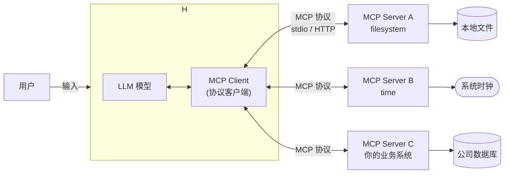

# MCP 入门与可运行示例（mcp-hello1）

> 这份文档把 MCP 从「听说」讲到「跑通」。每个代码块都能在本目录直接运行，
> 运行结果见文末「实测记录」（都是我在本机真实跑出来的）。

---

## 1. 一句话：MCP 是什么

**MCP（Model Context Protocol，模型上下文协议）是一套开放标准，用来把 AI 应用连接
到外部世界**——本地文件、数据库、搜索、计算器、你公司的内部 API……

官方原话：

> MCP is an open-source standard for connecting AI applications to external systems.
> Think of MCP like a USB-C port for AI applications.
> （MCP 是连接 AI 应用与外部系统的开源标准。把 MCP 想象成 AI 应用的 USB-C 接口。）

关键理解：**MCP 是「协议」，不是「产品」**。它规定的是「AI 应用」和「能力提供方」
之间怎么对话（消息格式、能力清单、调用约定）。就像 USB-C 规定了插头和电压，
至于插上去的是显示器还是硬盘，协议本身不管。

---

## 2. 为什么需要 MCP

在 MCP 之前，每接一个新能力，开发者都要为每个 AI 应用单独写一套对接代码：
给 ChatGPT 写一遍、给 Claude 写一遍、给 Cursor 写一遍…… 是 N×M 的重复劳动。

MCP 把它变成 N+M：能力提供方写一个 **MCP Server**，所有支持 MCP 的 **客户端**
都能连。写一次，到处能用。

| 受益方 | 得到什么 |
|---|---|
| 开发者 | 少写胶水代码，不用为每个平台重复对接 |
| AI 应用 / Agent | 一键接入海量现成的数据源和工具 |
| 终端用户 | AI 能真正用上你的数据和工具，而不只是聊天 |

---

## 3. 核心架构



三个角色：

- **Host（宿主）**：你实际用的那个 AI 应用（Claude Desktop、Cursor、VS Code、或你自研的 Agent）。它管着模型和用户界面。
- **Client（客户端）**：宿主内部负责「按 MCP 协议跟某个 server 说话」的组件。一个宿主可以管多个 client，各连一个 server。
- **Server（服务端）**：把某个能力（工具 / 数据）按 MCP 协议暴露出来的一方。可以是你自己写的，也可以是别人写的现成包。

### MCP Server 能暴露三种「原语」

| 原语 | 类比 | 谁触发 | 用途 | 本目录示例 |
|---|---|---|---|---|
| **Tools**（工具） | POST 请求 | **模型**自主调用 | 执行动作、计算、改数据 | `add`、`now` |
| **Resources**（资源） | GET 请求 | 宿主/用户决定注入 | 只读数据，URI 寻址 | `greeting://{name}` |
| **Prompts**（提示词模板） | 收藏的指令 | **用户**显式选择 | 预置可复用的交互模板 | `code_review` |

### 两种传输方式

- **stdio**：宿主把 server 当**子进程**拉起，通过标准输入输出一行行 JSON 通信。**本地**、简单、最常用。
- **Streamable HTTP**（旧版还有 SSE）：server 是个**常驻 HTTP 服务**，可被远程连接。适合部署。

> 换传输方式不影响业务代码——同一份 `server.py`，`mcp.run()` 跑 stdio，
> `mcp.run(transport="streamable-http")` 跑 HTTP。

---

## 4. CLI 是什么？MCP 和 CLI 有什么区别

这是最容易混淆的地方，先说结论：**它们不在一个维度上，不是二选一的对立面。**

- **CLI = Command Line Interface（命令行界面）**：一种**人操作程序**的方式——你在终端敲 `git commit`、`ls`、`docker run`，程序用文本回你。与之并列的是 GUI（图形界面）。
- **MCP = Model Context Protocol**：一种 **AI 模型调用外部能力**的方式——模型通过结构化协议去调工具，而不是敲命令行。

一个回答「**人**怎么用程序」，一个回答「**模型**怎么用程序」。

| 维度 | CLI | MCP |
|---|---|---|
| 面向对象 | 人 | AI 模型 / Agent |
| 交互形态 | 终端敲命令、文本流 | JSON-RPC 结构化调用 |
| 能发现什么 | 靠 `--help`/`man`，**人来读** | 协议自动 `list_tools()`，**机器来读** |
| 参数传递 | 拼命令行字符串 | JSON Schema 强类型校验 |
| 权限边界 | 系统用户权限 | 宿主显式控制暴露哪些能力 |
| 典型产物 | `git`、`ffmpeg` | 一个 filesystem MCP server |

**它们其实是好搭档**，而不是竞争关系：

1. 很多 MCP server 就是把一个 **CLI 工具包装**给人模型用。比如有个 MCP server 内部就是调 `ffmpeg` 命令。
2. MCP **自己也带 CLI**（见下一节）——用命令行来管理 MCP server，这时的「CLI」是工具，不是对手。

所以当你看到「MCP-CLI」时，通常指下面几种之一。

---

## 5. 你听到的「MCP-CLI」到底指什么

一共有三种常见含义，都真实存在：

**① MCP SDK 自带的 `mcp` 命令行工具**（本目录已装：`.venv/Scripts/mcp.exe`）

装 `mcp[cli]` 后会有 `mcp` 命令，用来开发和运行 server：

```bash
mcp dev server.py       # 用 MCP Inspector 可视化调试（浏览器界面）
mcp run server.py       # 直接运行
mcp install server.py   # 装进 Claude Desktop 配置
```

**② AI 客户端添加 MCP server 的命令**（各客户端自带）

比如 Claude Code / Claude Desktop 有类似：

```bash
claude mcp add filesystem npx -y @modelcontextprotocol/server-filesystem /some/path
```
用一条 CLI 命令把某个 MCP server 注册进客户端的配置。

**③ 泛指「用命令行方式管 MCP」**——不特指某个工具。

---

## 6. ⚠️ 版本现状：SDK v1 与 v2（务必知道）

MCP 迭代很快，这里有个**真实的坑**，我实测撞到了：

| | v1（老） | v2（新，当前稳定） |
|---|---|---|
| 安装 | `pip install "mcp<2"`（如 1.28.1） | `pip install mcp`（现在是 2.x） |
| Server 写法 | `from mcp.server.fastmcp import FastMCP` | `from mcp.server import MCPServer` |
| 状态 | 维护中、只收关键修复 | 当前主线 |

**网上绝大多数教程还是 v1 的 `FastMCP`，你照着抄可能 API 对不上。** 本文所有示例按
**v2** 写（本机实测版本 `mcp==2.2.0`）。

另一个实测到的现象：**现成的官方 Python server（如 `mcp-server-time`）仍基于 v1**，
和 v2 装在一起会把 `mcp` 降级。解决办法是用 `uvx` 给它们开**隔离环境**（见
`connect_external.py`）——反正 client 和 server 是**两个进程**，各用各的依赖，只靠
stdio 说 MCP 协议，版本互不影响。这也正是 MCP「进程边界」的价值。

> 实测补充：用 **v2 的 Client** 去连 **v1 的 server** 时，客户端会先发 v2 新的
> `server/discover` 探测方法，v1 server 不认，客户端再自动降级到 v1 的 `initialize`。
> 功能正常，但 stderr 会刷一批探测日志。这是过渡期的正常现象。

---

## 7. 本目录的示例与运行方式

```
server.py            最小 MCP Server：一个 tool、一个 resource、一个 prompt
client.py            用代码连接 server，演示 list / call / read / get_prompt
llm_agent.py         ★ 模型驱动 MCP：完整的 LLM 工具调用循环
connect_external.py  连接现成的第三方 MCP Server（官方 time server）
```

环境已备好（`.venv`），依赖是 `mcp[cli]`（v2）。在项目根目录：

```bash
# 1) 最小 server 自测 + 客户端调用（无需任何 API key）
.venv\Scripts\python.exe client.py

# 2) 模型驱动 MCP（内置离线 MockLLM，无需 key，直接看完整链路）
.venv\Scripts\python.exe llm_agent.py

# 2b) 换成真实模型（任何 OpenAI 兼容接口）
set LLM_BASE_URL=https://api.deepseek.com/v1
set LLM_API_KEY=sk-xxxx
set LLM_MODEL=deepseek-chat
.venv\Scripts\python.exe llm_agent.py --real

# 3) 连接现成的第三方 server（uvx 会自动隔离安装）
.venv\Scripts\python.exe connect_external.py

# 4) 可视化调试：用官方 MCP Inspector
.venv\Scripts\mcp.exe dev server.py
```

> Git Bash 用户：把 `.venv\Scripts\python.exe` 写成 `.venv/Scripts/python.exe`。
> 若中文乱码，前面加 `PYTHONUTF8=1`。

---

## 8. 如何接入现成的 MCP Server（不写代码）

你平时用得最多的场景其实是**在 AI 客户端里配置一个现成 server**。以 Claude Desktop 为例，
编辑它的配置 `claude_desktop_config.json`：

```json
{
  "mcpServers": {
    "filesystem": {
      "command": "npx",
      "args": ["-y", "@modelcontextprotocol/server-filesystem", "D:/my-project"]
    },
    "time": {
      "command": "uvx",
      "args": ["mcp-server-time"]
    }
  }
}
```

重启客户端后，模型就能调用 `filesystem` 和 `time` 里的工具了。字段含义：

- `command` / `args`：**怎么启动这个 server**（和 `connect_external.py` 里
  `StdioServerParameters` 一模一样——配置文件和代码两种方式，本质相同）。
- 提示词、资源、工具都会自动被发现，你不需要手动声明有哪些工具。

> Cursor / VS Code / Windsurf 等配置思路相同，只是配置文件位置和字段名略有差异。

---

## 9. 实测记录（本机真实运行）

| 验证项 | 命令 | 结果 |
|---|---|---|
| 最小 server + client 三原语 | `python client.py` | exit 0；list_tools 返回 `add`/`now`，`add(3,4)→7`，读到 `greeting://Alice`，渲染 `code_review` |
| 模型驱动 MCP 循环 | `python llm_agent.py` | exit 0；输出 `[模型决定调用] add({'a':3,'b':4})` → `[MCP 执行结果] 7` → 最终回答 |
| 连接现成第三方 server | `python connect_external.py` | exit 0；列出 `get_current_time`/`convert_time`，调用返回 Asia/Shanghai 当前时间 |
| v2 API 形态 | 探针 `from mcp.server import MCPServer` | OK（`mcp==2.2.0`） |
| v1/v2 生态冲突 | 装 `mcp-server-time` | 把 `mcp` 从 2.2.0 降到 1.30.0 → 改用 uvx 隔离 |

已知环境限制：本机 `npm`（10.8.1 + Node 24）运行 `npx` 时报
`Class extends value undefined...`，导致最初的 npx 版 filesystem server 启动失败——
这是本机 npm 自身问题，与 MCP 代码无关，故示例改用 Python 版 time server。
